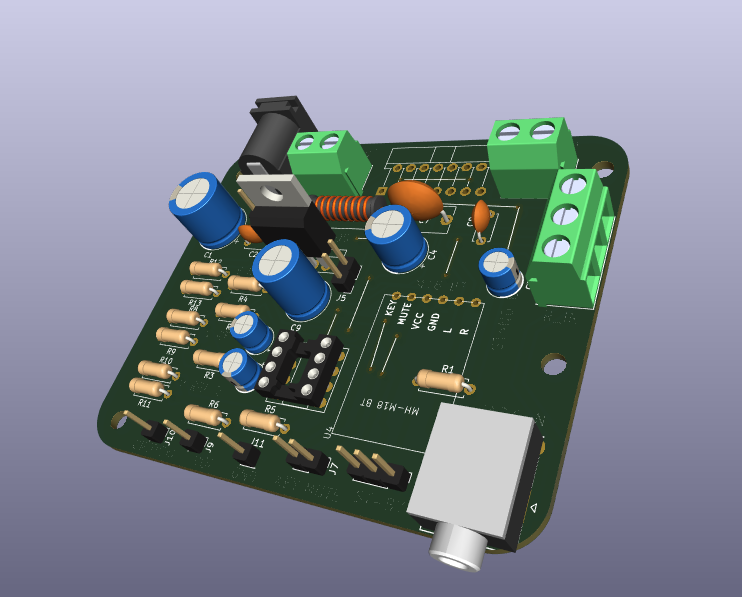
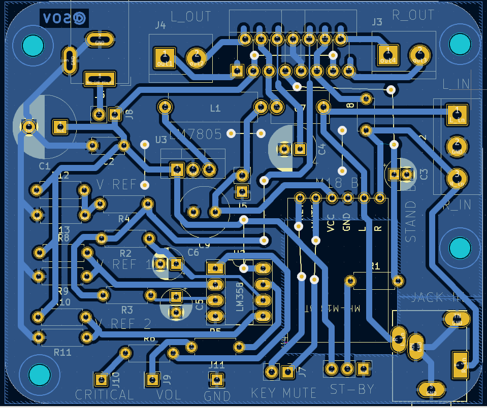
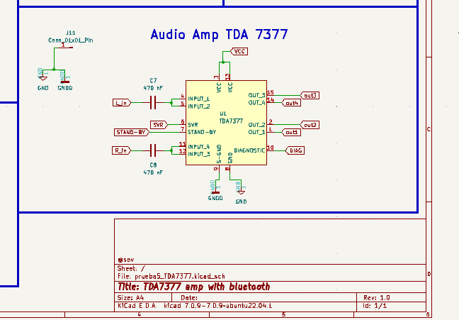

 # Amplifier with audio-car amp TDA7377

This repo contains no only desing files for this amplifier but also an easy design for a coupling board that allows use the IC in any protoboard, this is under _proto_ folder wich has the gerber and .nc files for fabrication.

---

The goal it's to create a complete audio device 2.0 with audio jack - bluetooth input the cheapest way.
Following that, all is minded to be throug hole components, also using less space possible and carving circuits with a simple CNC 3018.

---

At actual stage I got the basic functions (stereo input with audio Jack and bluetooth) but it's lacking the front board with leds and control, including switchs for power.

---

Some files in this project, like CAD models (.stp files) bornier and DC jack are not free and was obtained in web research.